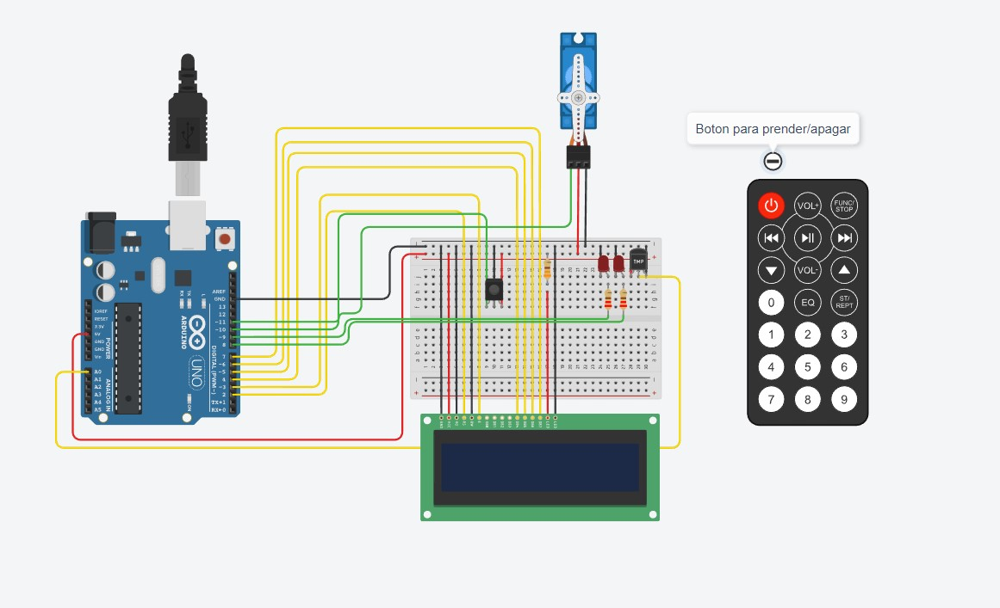
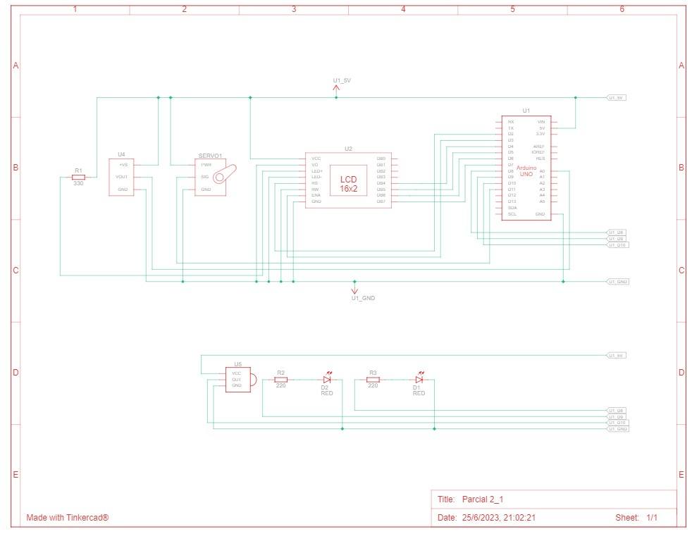

## Integrante
- Gonzalo Rojas

## Proyecto: Sistema de Alarma.

## Descripción:
• Se nos pide armar un arduino que cumpla los requerimientos que pide el enunciado siguiente:
• https://drive.google.com/file/d/1Af93a100_PRCv27KyVkwG_JjW-Zck8Dk/view

## Funcion del Proyecto:
•  Un sistema de incendio utilizando Arduino que pueda detectar cambios de temperatura y activar un servo motor en caso de detectar un incendio. Además, se mostrará la temperatura actual y la estación del año en un display LCD.

## Requisitos del Proyecto:
1- Debe poder explicar cada punto
2- Debe poder modificar la funcionalidad agregando lo que sea necesario
3- Documentación:
• Deberán presentar un diagrama esquemático del circuito y explicar el
funcionamiento aplicado de cada componente.
• Presentar el código fuente del proyecto de Arduino listo para ser
implementado.
• Deberán explicar el funcionamiento integral utilizando documentación
MarkDown.

~~~ C++ (lenguaje en el que esta escrito)
#include <IRremote.h>
#include <Servo.h>
#include <LiquidCrystal.h>

// DECLARACION DE VARIABLES
LiquidCrystal lcd(2, 3, 4, 5, 6, 7);
Servo myServo;

int SERVO = 11;
int LED1 = 9;
int LED2 = 8;
int SDT = A0;

int RECV_PIN = 10;
IRrecv irrecv(RECV_PIN);

decode_results results;

bool sistemaprendido = true;

void setup()
{
  Serial.begin(9600);
  
  pinMode(LED1, OUTPUT);
  pinMode(LED2, OUTPUT);
  
  pinMode(A0, INPUT);
  
  lcd.begin(16, 2);
  
  myServo.attach(SERVO);
  
  irrecv.enableIRIn();
}
 

void loop()
{
  if (sistemaprendido)
  {
    // Lectura de temperatura y control del servo
    float temp = ((analogRead(A0) * (5.0 / 1024)) - 0.5) / 0.01;
    lcd.setCursor(0, 0);
    lcd.print("Temperatura:");
    lcd.setCursor(0, 1);
    myServo.write(0); 
    
    if (temp < -20)
    {
      
      lcd.setCursor(0, 1);
      lcd.print("HACE FRIOOO O.O");
    }
    else if (temp >= -20 && temp <= 15)
    {
      lcd.setCursor(0, 1);
      lcd.print("Invierno");
    }
    else if (temp >= 16 && temp <= 29)
    {
      lcd.setCursor(0, 1);
      lcd.print("Pri/Oto");
    }
    else if (temp >= 29 && temp <= 45)
    {
      lcd.setCursor(0, 1);
      lcd.print("Verano");
    }
    else if (temp >= 46 && temp <= 59)
    {
      lcd.setCursor(0, 1);
      lcd.print("HACE CALORRR x.x"); 
    }
    else if (temp >= 60)
    {
      lcd.setCursor(0, 1);
      lcd.print("INCENDIO!!!");
      ALARMA();
      myServo.write(90);
      ALARMA();
    }
	lcd.print("                  "); // Borra el contenido anterior
    lcd.setCursor(12, 0);
    lcd.print(temp);
    Serial.println(temp);
    
    if (IrReceiver.decode()) 
        {
            Serial.println(IrReceiver.decodedIRData.decodedRawData);
            IrReceiver.resume();
            switch (IrReceiver.decodedIRData.decodedRawData)
            {
                case 4278238976:
                sistemaprendido = false;
                digitalWrite(LED1, LOW);
                digitalWrite(LED2, LOW);
                lcd.setCursor(0, 0);
                lcd.print("                ");
                lcd.setCursor(0, 1);
                lcd.print("                ");
                break;
            }
            delay(50);
            irrecv.resume();
        }

  }
  else
  {
    if (IrReceiver.decode()) 
    {
        Serial.println(IrReceiver.decodedIRData.decodedRawData, HEX);
        IrReceiver.resume();
        switch (IrReceiver.decodedIRData.decodedRawData)
        {
            case 4278238976:
              sistemaprendido = true;
        }
        delay(50);
        irrecv.resume();
    }

    
    
  }
}
void ALARMA()
{
  digitalWrite(LED1, HIGH);
  delay(200);
  digitalWrite(LED1, LOW);
  digitalWrite(LED2, HIGH);
  delay(200);
  digitalWrite(LED2, LOW);
}

~~~
## Diagrama esquemático

## Link al proyecto
- [Proyecto](https://www.tinkercad.com/things/17SVgbWKUgx-parcial-21/editel?sharecode=VESztc-H09SuKjdHfI0CQDcRS2rH9W1tuFLGj3ILpk4)

---

